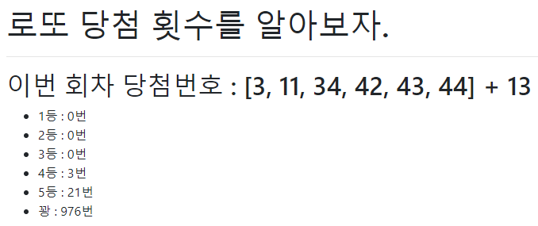

# 200818 practice




## 1. practice/urls.py

```python
from django.contrib import admin
from django.urls import path, include

urlpatterns = [
    path('admin/', admin.site.urls),
    path('pages/', include('pages.urls'))
]
```


## 2. pages/views.py

```python
from django.shortcuts import render
import requests
import json
import random

def lotto(request):
    response = requests.get('https://www.dhlottery.co.kr/common.do?method=getLottoNumber&drwNo=924')
    json_response = json.loads(response.text)

    win_number = sorted([json_response.get(f'drwtNo{i}') for i in range(1,7)])
    bns_number = json_response.get('bnusNo')
    result = [0 for _ in range(6)]
    
    for i in range(1000):
        numbers = set(random.sample(range(1,46), 6))
        cnt = len(set(win_number) & numbers)
        if cnt == 6:
            result[0] += 1
        elif cnt == 5 & bns_number in numbers: 
            result[1] += 1
        elif cnt == 5:
            result[2] += 1
        elif cnt == 4:
            result[3] += 1
        elif cnt == 3:
            result[4] += 1
        else:
            result[5] += 1

    context = {
        'win_number': win_number,
        'bns_number': bns_number,
        'results': result,
    }

    return render(request, 'pages/lotto.html', context)
```


## 3. templates/lotto.html

```html



    lotto




    <h1>로또 당첨 횟수를 알아보자.</h1>
    <hr>
    <h2>이번 회차 당첨번호 : {{ win_number }} + {{ bns_number }}</h2>
    <ul>
        
            
                <li>{{ forloop.counter }}등 : {{ result }}번</li>
            
                <li>꽝 : {{ result }}번</li>
            
        
    </ul>

```

