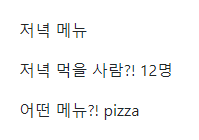

# 200818 Workshop




## 1. intro/urls.py

```python
from django.urls import path
from . import views


app_name = 'pages'
urlpatterns = [
    path('dinner/<str:menu>/<int:population>/', views.dinner, name='dinner'),
]
```


## 2. pages/views.py

```python
from django.shortcuts import render

# Create your views here.
def dinner(request, menu, population):
    
    context = {
        'menu': menu,
        'population': population,
    }
    
    return render(request, 'pages/dinner.html', context)
```


## 3. templates/dinner.html

```html




    Dinner




    <p>저녁 메뉴</p>
    <p>저녁 먹을 사람?! {{ population }}명</p>
    <p>어떤 메뉴?! {{ menu }}</p>

```

