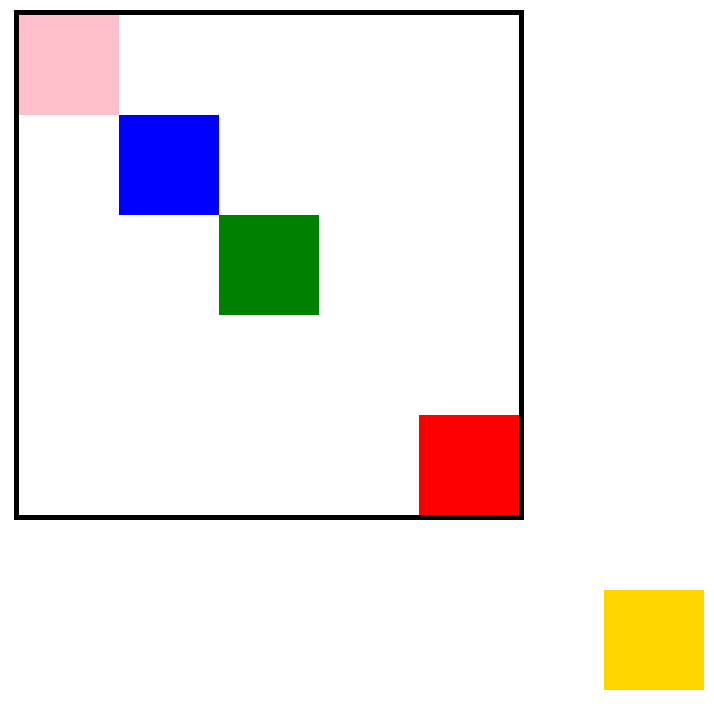
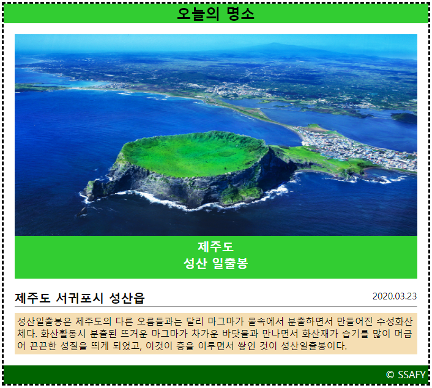

# 200811 Practice

## 1. Box Model



```css
.big-box {
  position: relative;
  margin: 100px auto 500px;
  border: 5px solid black;
  width: 500px;
  height: 500px;
}

.small-box {
  width: 100px;
  height: 100px;
}

#red {
  background-color: red;
  /* 큰 사각형 내부의 우측 하단 모서리에 빨간 사각형 위치시키기 */
  position: absolute;
  bottom: 0px;
  right: 0px;
}

#gold {
  background-color: gold;
  /* 브라우저의 하단에서 50px, 우측에서 50px 위치에 고정하기 */
  position: fixed;
  bottom: 50px;
  right: 50px;
}

#green {
  background-color: green;
  /* 큰 사각형의 가운데 위치시키기 */
  position: absolute;
  top: 50%;
  left: 50%;
  margin-top: -50px;
  margin-left: -50px;
}

#blue {
  background-color: blue;
  /* 큰 사각형 좌측 상단 모서리에서 100px, 100px 띄우기 */
  position: absolute;
  top: 100px;
  left: 100px;
}

#pink {
  background-color: pink;
  /* 큰 사각형 내부의 좌측 상단 모서리로 옮기기*/
  position: absolute;
  top: 0px;
  left: 0px;
}
```


## 2. CSS Styling



```css
* {
  box-sizing: border-box;
  margin: 0;
  padding: 0;
}

h4 {
  font-size: 20px;
  font-weight: bold;
  font: Arial;
}

p {
  font: Arial;
  font-size: 15px;
}

.container {
  width: 1200px;
  margin: 200px 200px;
}

.card {
  width: 700px;
  border: black dashed;
}

.card-nav {
  background-color: limegreen;
  text-align: center;
}

.card-header {
  margin: 18px;
}

.card-img {
  display: block;
  height: 330px;
  width: 658px;
}

.card-img-description {
  height: 70px;
  background-color: limegreen;
  padding-top: 4px;
  color: white;
  text-align: center;
}

.card-body {
  position: relative;
  margin: 18px;
}

.card-body-title > p {
  position: absolute;
  top: 0px;
  right: 0px;
}

.card-body-content {
  background-color: wheat;
  margin-top: 9px;
  padding: 4px;
}

.card-footer {
  background-color: darkgreen;
  padding: 4px;
  height: 30px;
  color: white;
  text-align: right;
}
```